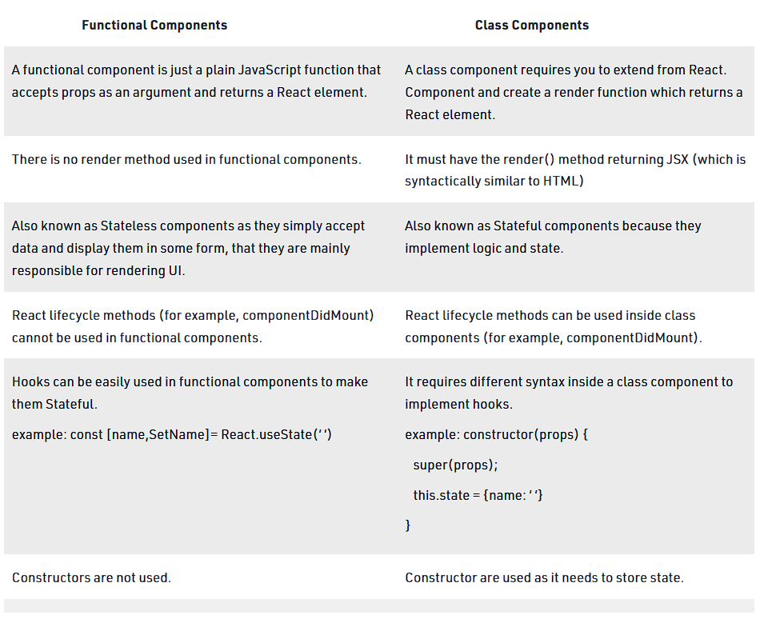

1. ### What is React and explain its features?

    React is an open-source front-end JavaScript library that is used for building user interfaces, especially for single-page applications. It is used for handling view layer for web and mobile apps. The major features that React has:
    * It uses **VirtualDOM** instead of RealDOM considering that RealDOM          manipulations are expensive.
    * It has **React-native** for building mobile applications.
    * Follows **Unidirectional** data flow or data binding.
    * Uses **reusable/composable** UI components to develop the view.

2. ### What is JSX?

    It is and XML(eXtensible Markup Language) like syntax extension to ECMAScript having full form Javascript XML. Basically it just provides syntactic sugar for the **React.createElement()** function, giving us expressiveness of JavaScript along with HTML like template syntax.

3.  ### What is Virtual DOM?

    * The *Virtual DOM* is an in-memory representation of *Real-DOM*.
    * The representation of a UI is kept in memory and synced with the "real" DOM.
    * It's a step that happens between the render function being called and the displaying of elements on the screen.
    * This entire process is called *reconciliation*.

4. ### Diffrence between Class and Functional Components?

    
